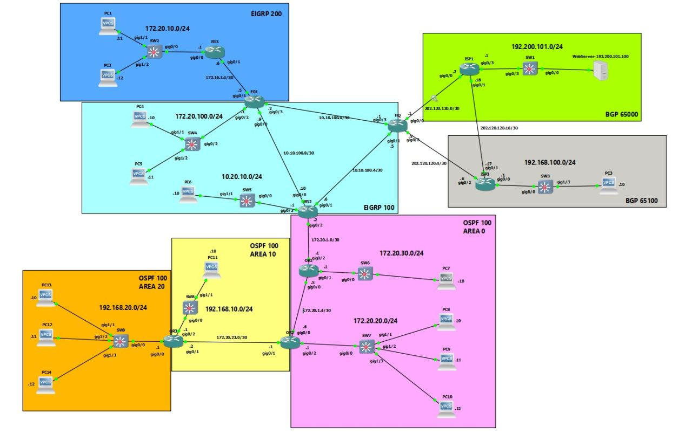
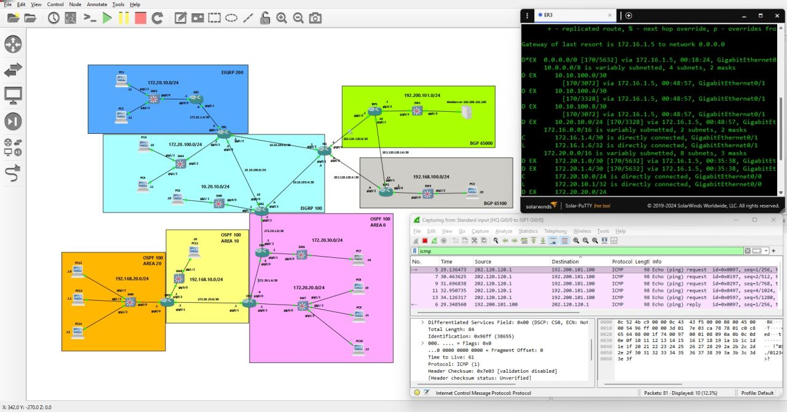
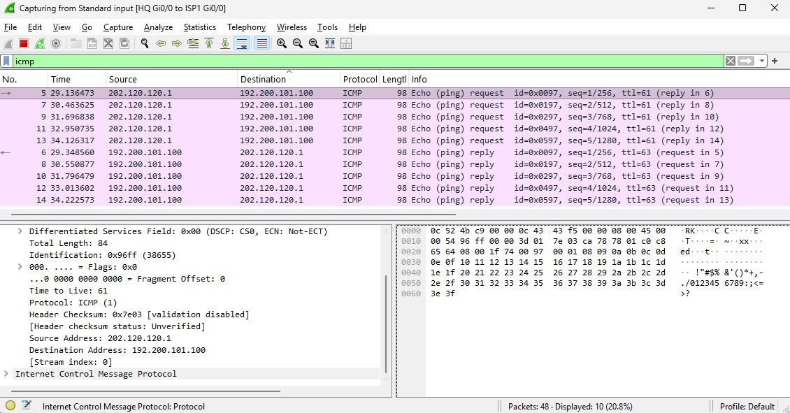

# 🚀 The Converged Core: Multi-Protocol Enterprise WAN Architecture

## 📌 Project Overview
This advanced standalone repository showcases the implementation of a high-fidelity, resilient multi-protocol enterprise network architecture. Designed and fully emulated within **GNS3** using virtualized Cisco software planes, this capstone infrastructure solves complex engineering problems surrounding routing boundary interconnections, mutual route redistribution control loops, edge parameter translation, and automated WAN stateful failovers.

The network successfully bridges a hierarchical Multi-Area OSPFv2 campus environment natively with a Dual-AS EIGRP corporate core, stretching across optimized border translation parameters into an active multi-homed external eBGP Internet routing edge.

---

## 🗺️ Master Topology & Emulation Fabric

The network layout captures multi-domain boundary handshakes, strict area segmentation patterns, and high-availability transit corridors mapped concurrently across the entire corporate infrastructure.

---

## 🛠️ Technical Stack & Implementation Mechanics

### 1. Multi-Domain Core Integration
* **Hierarchical Multi-Area OSPFv2 Infrastructure:** Segmented the core campus network into an active backbone (**Area 0**), an internal operations perimeter (**Area 10**), and a remote access layer block (**Area 20**) to dramatically scale down Link-State Advertisement (LSA) flooding boundaries and stabilize the localized database structures.
* **Dual-AS EIGRP Domain Segregation:** Configured and isolated two distinct EIGRP autonomous system environments (**AS 100** and **AS 200**) to emulate separate high-throughput corporate divisions or distinct business partner networks.
* **ASBR Mutual Route Redistribution:** Engineered bidirectional route redistribution at the Autonomous System Boundary Router (ASBR) junctions to facilitate seamless prefix visibility across completely different routing protocol suites.
* **Seed Metric & Cost Tuning:** Tuned precise EIGRP composite vector constants (bandwidth, delay, reliability, load, and MTU weights) during dynamic injection loops alongside explicit external type bindings in OSPF to prevent suboptimal path selection and routing loops.

### 2. Exterior Peering & Edge Perimeter Defense
* **External eBGP Peer Multi-Homing:** Deployed multi-AS external BGP peer connections over public WAN links to simulate external Internet reachability across upstream Service Provider boundaries (AS 65000 and AS 65100).
* **Dynamic NAT Overload (PAT):** Implemented Port Address Translation on edge gateway nodes, securely mapping internal corporate private subnets out to publicly routable global spaces via unique Layer 4 port tracking.
* **Automated Translation Path Failover:** Programmed advanced conditional `route-maps` paired with **Floating Static Routes** (inflating the Administrative Distance of backup links to 50) to force automated, dynamic data payload swinging to the alternate ISP in the event of a primary link failure.
* **Perimeter Access Control Lists (ACLs):** Configured and enforced strict Named Access Lists to regulate perimeter security boundaries, dropping unauthorized transit reconnaissance, inter-subnet spoofing vectors, and illicit control plane probing.

---

## 📊 Verification, Validation & Control Plane Diagnostics

Comprehensive CLI auditing, data-path traceroute mapping, and real-time packet-level frame parsing were performed to confirm flawless system wide multi-protocol convergence:

### 🔹 Advanced Control Plane Diagnostics (Main)
Auditing the active runtime state machine engines, local protocol configurations, and live memory spaces across the core routing infrastructure.

### 🔹 Core Routing Table Analysis & Inter-Domain Prefixes
Reviewing the centralized IP routing matrix to confirm successful redistribution injection, verifying multi-domain reachability indicators such as **D EX** (EIGRP External) and **O IA** (OSPF Inter-Area) routes.

### 🔹 Packet-Level Frame Inspection (Wireshark Capture)
Leveraging deep network parsing via inline Wireshark pipes to analyze transiting frame structures, verifying address translation efficiency and seamless end-to-end ICMP transport reachability.

---
## 👥 Author Profile

* **Network Architect:** John Ivan P. Ello
* **Professional Credentials:** Summa Cum Laude Graduate, BS in Information Systems | CCNA Certified
* **Email:** [1ello.johnivan03@gmail.com](mailto:1ello.johnivan03@gmail.com)
* **LinkedIn:** [linkedin.com/in/johnivanello](https://www.linkedin.com/in/johnivanello/)
* **GitHub Portfolio:** [github.com/JohnIvan-Ello](https://github.com/JohnIvan-Ello)
